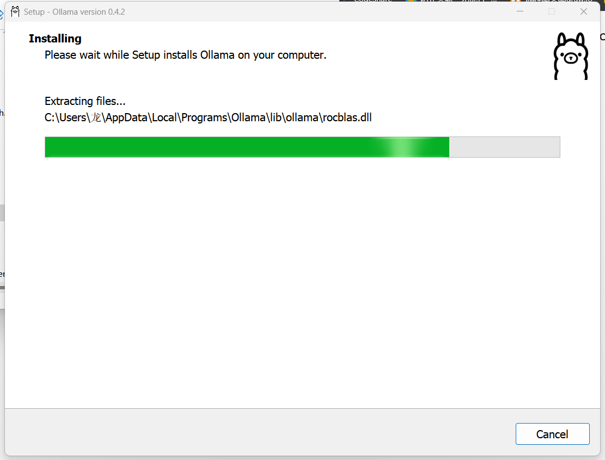
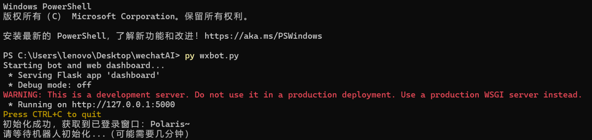

# WXBot - 微信机器人开源项目

## 项目概述
微信机器人项目旨在为没有公司验证的微信个人账户提供宣传营销等业务的半自动化回复解决方案。该项目将利用开源技术、框架和项目，以桌面程序的形式交付，以满足用户在微信平台上进行自动化客户服务和营销的需求。

## 技术栈
使用wxauto库作为微信自动化控制接口，并使用本地sqlite数据库保存用户配置信息，通过flask对配置信息进行管理，通过request调用ollama中的本地模型。

## 功能特点
- **自动回复**：支持微信消息的自动回复功能。
- **自定义行为**：允许开发者自定义机器人的提示词以实现行为指导。
- **管理界面**：通过Flask框架提供简洁的管理界面。

## 环境要求
- Python环境
- Windows Powershell（仅限Windows用户）

## 安装步骤

### 步骤 1: 获取WXBot仓库
下载压缩包或拉去本项目。


### 步骤 2: 下载Ollama模型
访问[Ollama官方下载页面](https://ollama.com/download)下载Ollama模型。



### 步骤 3: 安装Ollama模型
安装完成后，打开Windows Powershell，输入以下命令安装模型（也可启动别的模型，但需要相应的修改const.py里的模型名）：
```
ollama run qwen2.5:0.5b
```


### 步骤 4: 安装依赖
找到下载的wxbot文件夹，打开终端或命令提示符，输入以下命令安装依赖：
```
pip install -r requirements.txt
```

### 步骤 5: 运行WXBot
在`wxbot`文件夹中，打开终端或命令提示符，输入以下命令启动WXBot：
python wxbot.py


### 步骤 6: 访问管理界面
在Powershell中按住`Ctrl`键并点击域名`127.0.0.1:5000`，打开管理界面。


### 步骤 7: 创建微信机器人
- 点击“微信机器人管理”。
- 您可以在`微信机器人管理`添加机器人以及机器人负责的聊天
- 您可以在`机器人回复设置`那里添加您个性化的机器人提示词

- 点击“创建机器人”，并输入微信机器人名称。

- 选择你想关联的用户。


### 步骤 8: 正式运行
完成上述步骤后，直接关闭 `执行python wxbot.py的控制台` 然后重启，您的微信机器人即可正式运行。


## 许可证
本项目采用 [Apache License 2.0](LICENSE)。

## 可能存在的问题
wxauto必须要等监听用户独立聊天框全部出现后（这里的出现指微信聊天页选中一个聊天后双击弹出的那种）才能开始监听，如果启动wxbot后一直显示 `请等待机器人初始化...`，有可能等一段时间后就都打开了，如果觉得慢可以试试手动全部点开后重启，会快很多。另外如果一条消息机器人没反应，可能重新发送一次就有反应了。机器人回复消息内容时可能存在bug，请不要使用在正式的聊天中以免出现严重后果。本项目由四名学生在做其课设过程中产生，目前处于原型阶段，请见谅。